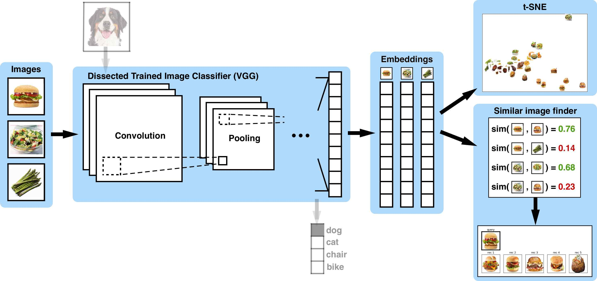
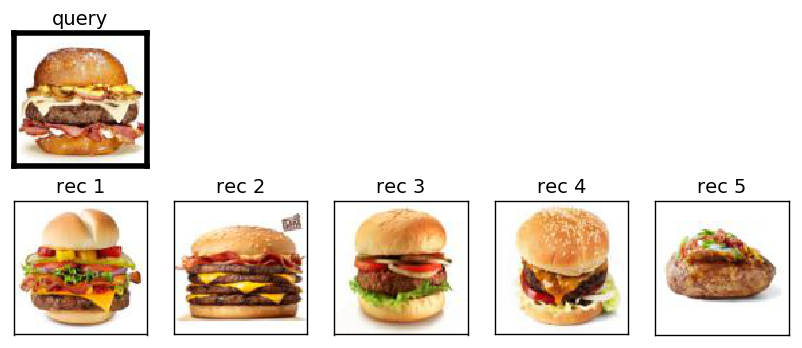
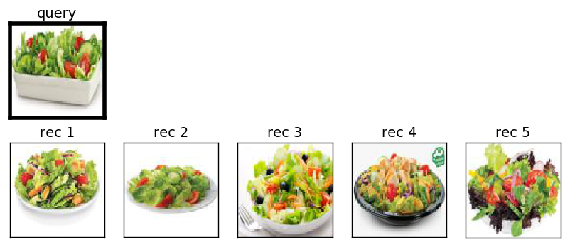
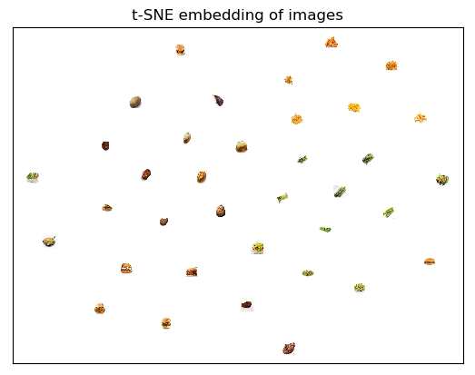

# Image_retrieval_demo: a demo for image retrieval

This project is forked from [artificio](https://github.com/ankonzoid/artificio). I change the codes and use caffe instead of keras and tensorflow which he use.

## Image retrieval using transfer learning

Given a set of database images, we take the trained image classification AlexNet, remove its last layers, and use the dissected model to convert our raw images into feature vectors for similarity comparison to produce similar image recommendations. No training is needed as we are re-using the low-level weight layers in the AlexNet network. A schematic for our implementation is shown here:

<p align="center">

</p>

As an example of its utility, we show that we can find similar food items in a small steakhouse food database by querying a burger and a salad below:

<p align="center">

</p>

<p align="center">

</p>

In addition to making similar image recommendations, we can also visualize the image feature vectors by mapping the high-dimensional vectors onto a 2-dimensional manifold via the t-SNE algorithm to get a sense of how "far away" images are from each other in the feature space:

<p align="center">

</p>

The steps towards building our similar images finder:

1. Prepare our image database. We prepared by default a 36 images database of common steakhouse foods (6 classes).

2. Take the AlexNet model and remove its last layers.

3. Convert our image database into feature vectors using our dissected AlexNet model. If the output layer of the dissected model are convolutional filters then flatten the filters and append them make a single vector.

4. Compute similarities between our image feature vectors using an inner-product such as cosine similarity or euclidean distance

5. For each image, select the top-k images that have the highest similarity scores to build the recommendation

### Required libraries:

* caffe, numpy, matplotlib, sklearn, h5py, pillow

### Usage:

0. Install caffe and pycaffe. Instructions are [here](http://caffe.berkeleyvision.org/installation.html)
   Install the python dependence. If you use conda, you can use `environment.yml` file to create an environment. Run the command:

   > conda env create -f environment.yml

   Activate the new environment (for linux):

   > source activate caffe

1. Place your database of images into the `db` directory.

2. Change the codes. Open `similar_images_caffe.py` in `src` and change the `caffe_root` to your `$CAFFE_ROOT`.

2. Enter the `src` folder. Run the command:

    > python similar_images_caffe.py

    All output from running this code will be placed in the `output` directory. There will be a `tsne.png` plot for the t-SNE visualization of your database image embeddings, as well as a `rec` directory containing the top `k = 5` similar image recommendations for each image in your database.

If the program is running properly, you should see something of the form:

```
Loading pre-trained model...
...
...
...
Reading images from 'db' directory...

('read', 'asparagus1_resized')
('read', 'asparagus2_resized')
('read', 'asparagus3_resized')
...
('read', 'steak4_resized')
('read', 'steak5_resized')
('read', 'steak6_resized')
imgs.shape = (39, 224, 224, 3)
X_features.shape = (39, 100352)

[1/39] Plotting similar image recommendations for: steak2_resized
[2/39] Plotting similar image recommendations for: asparagus5_resized
[3/39] Plotting similar image recommendations for: steak4_resized
...
...
...
[38/39] Plotting similar image recommendations for: salad4_resized
[39/39] Plotting similar image recommendations for: burger_test
Plotting tSNE to output/tsne.png...
Computing t-SNE embedding
```


### Authors:

Anson Wong, Guo-Hua Wang
